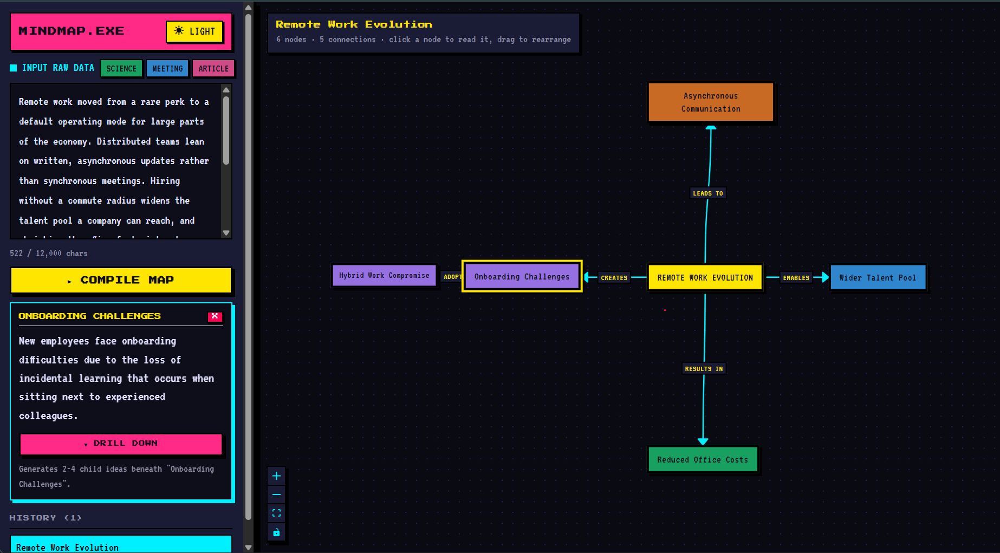

# Mini Mindmap

Turns a block of prose into an interactive node-link mindmap. An LLM proposes
the structure; the backend refuses to believe it until it validates.



---

## Quick start (no API key needed)

The app ships with `MOCK_MODE` on by default, so it runs end to end with no
credentials.

```bash
# Terminal 1 - backend
cd backend
npm install
cp .env.example .env      # MOCK_MODE=true is already set
npm run dev               # http://localhost:3001

# Terminal 2 - frontend
cd frontend
npm install
npm run dev               # http://localhost:5173
```

Open http://localhost:5173, press one of the **SCIENCE / MEETING / ARTICLE**
sample buttons, then **COMPILE MAP**.

Requires Node 20+ (developed on 22).

### Running against a real model

```bash
# backend/.env
MOCK_MODE=false
GEMINI_API_KEY=your_key_here      # https://aistudio.google.com/apikey
GEMINI_MODEL=gemini-3.6-flash     # optional override
```

**Provider: Google Gemini**, via the current `@google/genai` SDK, using genuine
structured output — the JSON Schema is handed to the model through
`responseJsonSchema`, not asked for in prose.

---

## How MOCK_MODE works

`MOCK_MODE=true` swaps the Gemini provider for a mock one behind the same
interface. It is **not** a shortcut around the pipeline: the mock returns a raw
JSON string exactly as the real provider does, so parsing, schema validation and
the corrective-retry path all run identically. Mock mode skips the network call,
not the safety net.

It answers all four generation tasks (outline, detail, single-pass, expansion):

- **Three keyword-matched fixtures** — photosynthesis, sprint notes, remote work.
  Paste anything mentioning two or more of a fixture's keywords and you get that
  canned mindmap. The sample buttons load exactly these.
- **A synthetic fallback** for everything else, built deterministically from the
  text you pasted, so arbitrary input still produces a structurally valid map.

### Seeing the repair logic without an API key

```bash
# backend/.env
MOCK_FAIL_FIRST=true
```

The first model call of every phase then returns output that is valid JSON but
breaks the contract — a duplicated id, a dangling edge, a self-loop, a `rootId`
pointing at nothing. Generate a map and the corrective retry appears live in the
progress log, listing the exact validator messages fed back to the model.

---

## The interesting part: treating model output as untrusted

The design question in this brief is *what happens when the model is wrong*, so
that boundary is the one place everything funnels through.
`requestValidated` in [backend/src/ai/generator.ts](backend/src/ai/generator.ts)
is the only function that turns provider text into a value the rest of the app
may use.

**One source of truth for the schema.** The Zod schema generates the JSON Schema
sent to the model (`z.toJSONSchema`) *and* validates what comes back, so the
shape we ask for and the shape we enforce cannot drift apart. Zod's `.refine`
checks are deliberately dropped from the generated JSON Schema — they are our
backstop, not the model's contract.

**Every rule in the brief is enforced in code**, plus a few it implies:

| Rule | Where |
|---|---|
| 5–9 nodes including the root | `MindmapShapeSchema` |
| `rootId` matches a real node | `rootExists` refinement |
| No dangling `from` / `to` | `noDanglingEdges` refinement |
| Node ids unique | `uniqueIds` refinement |
| Labels 1–4 words | `MindmapNodeSchema` |
| No self-loops | `noSelfLoops` refinement |

**The retry is corrective, not a reroll.** A plain re-ask just rolls the dice
again. On failure the retry prompt carries the model's own rejected output plus
the precise validator messages it violated, and asks it to change only what is
broken. Exactly one retry, then a clear `422` — never a stack trace.

**Unparseable and invalid are handled identically.** A truncated response and a
response with a dangling edge are the same class of problem: the model said
something we cannot use. Both take the same repair path.

**Input is guarded before a token is spent.** Empty, whitespace-only, under 20
characters, or over 12,000 characters (~3k tokens) is rejected without calling
the provider. Long input is **refused rather than silently truncated** —
summarising half a document and presenting it as the whole thing is worse than a
clear error.

---

## API

| Method | Route | Purpose |
|---|---|---|
| `POST` | `/api/mindmaps` | Generate, store, return the mindmap with an id |
| `POST` | `/api/mindmaps/stream` | The same flow over Server-Sent Events |
| `GET` | `/api/mindmaps` | List — `id`, `title`, `createdAt` |
| `GET` | `/api/mindmaps/:id` | One stored mindmap in full |
| `POST` | `/api/mindmaps/:id/expand` | Drill one level into a node |
| `GET` | `/api/health` | Status, and whether mock mode is on |

Request bodies are validated with Zod. Errors are shaped centrally, and an
unexpected throw collapses to a generic 500 rather than leaking a provider
message or a file path.

```json
{
  "error": "Request body failed validation",
  "code": "INVALID_REQUEST",
  "details": [
    { "path": "text", "message": "text must be at least 20 characters to summarise" }
  ]
}
```

Mindmaps persist to `backend/data/mindmaps.json`, so they survive a restart and
not just a request. Set `MINDMAP_STORE=memory` to keep them in memory only.

---

## Stretch goals

The brief says to pick one or two, and I built all four — which is worth
justifying rather than glossing over. They were chosen because they **interlock**
rather than merely stack up: two-phase generation is what gives streaming
something real to stream, and drill-down reuses the same validated generator with
a narrower scope. If you would rather judge one, judge **two-phase generation**;
it is the one that changed output quality.

### Two-phase generation (`GENERATION_MODE=two-phase`, the default)

Phase 1 asks only for the title, ids and labels. Phase 2 writes the summaries and
connections **against an id set that is already fixed**.

- **Quality.** The real win. Phase 2 is validated against phase 1's ids, so
  unknown-id and dangling-edge failures become *structurally unavailable* rather
  than merely discouraged by the prompt. Single-pass mode
  (`GENERATION_MODE=single`) is kept, and it is measurably looser.
- **Cost.** A repair re-runs only the failed phase, so a bad summary no longer
  costs a fresh outline — and phase 1's output is small.
- **Latency.** The honest trade-off: two sequential calls are slower than one.
  Streaming is what pays for it — the outline reaches the user early, so
  perceived latency drops even though total latency rises.

### Streaming generation (SSE)

`POST /api/mindmaps/stream` emits `accepted → outline → outline-ready → detail →
validated`, plus a `repair` event whenever a retry fires. `EventSource` only
speaks GET and the source text belongs in a body, so the client reads SSE frames
off the `fetch` response directly.

The payoff is that a repair retry — normally invisible — surfaces in the UI as it
happens, carrying the validator's own messages.

### Drill-down expansion

Clicking a node and pressing **DRILL DOWN** generates 2–4 children for that node
alone. It reuses the same untrusted-output boundary; only the validator changes,
scoped to the graph being expanded so a new layer cannot collide with an existing
id or dangle off the graph. The server returns the whole merged mindmap, so the
client never reconciles graph state itself.

### Light/dark theme

Driven entirely by CSS custom properties. The toggle sets one `data-theme`
attribute on `<html>` and every surface, border, node and edge follows. Two token
families do the work: `--on-*` carries the text colour that stays legible on a
given fill, and `--heading` keeps emphasis text separate from `--highlight` —
a fill colour and a text colour cannot be the same value once the background
flips.

---

## Frontend notes

- **Layout is computed from the connection graph, not node order.** BFS from the
  root assigns depth, the first ring spreads around the centre, and deeper layers
  fan out from their own parent — so a drill-down stays visually attached to the
  node it came from.
- **Nodes are coloured by branch.** Each first-ring subtree gets a hue and its
  children inherit it, so colour encodes tree structure. The palette was checked
  with a contrast/colour-blindness validator rather than picked by eye, and
  passes lightness, chroma, CVD separation and contrast in both themes. Colour is
  a *redundant* cue — every node is directly labelled and joined by a labelled
  edge — so nothing depends on telling two hues apart.
- **Edges pick whichever pair of handles faces the other node**, which stops
  connections looping around the outside of a box in a radial layout.
- Nodes are draggable; React Flow owns positions once mounted.

---

## Tests

```bash
cd backend  && npm test     # 40 passing
cd frontend && npm test     # 29 passing
```

No test touches a real provider. The seam is the provider interface, so the
generator, controller, repository and router all run for real underneath.

**Backend** covers the corrective retry (asserting the retry prompt genuinely
carries the validator's messages), giving up after exactly one retry, each
validation rule individually, unparseable output, all three input guards, the
successful create flow, request-validation failures, 404s, the streaming
endpoint, and drill-down including id-collision rejection.

**Frontend** covers empty/error/loading states, click-to-reveal summary,
switching between nodes, drill-down merging, the streamed repair event appearing,
the progress log retiring itself, and the layout maths.

---

## Trade-offs, and what I would do next

Made deliberately, under time pressure:

- **In-process JSON file storage** rather than MongoDB. It satisfies "survives
  beyond a single request", and swapping it means reimplementing one class — but
  it is not concurrency-safe and would not survive two server instances.
- **Long input is rejected, not chunked.** The right default, but a real product
  would map-reduce a long document into sections rather than refusing it.
- **The graph remounts on expansion**, re-running the layout and discarding
  manual dragging. Acceptable since a new layer needs re-laying out anyway, but a
  production version would animate new nodes in and keep positions.
- **No auth and no rate limiting.** An unauthenticated endpoint that spends money
  per call is fine for an exercise and for nothing else.
- **Two-phase doubles the round trips.** Justified above, but on a fast model a
  single well-constrained call may win — hence the env switch.

With more time, in order:

1. **Cache generations by input hash.** Regenerating identical text bills twice
   for no reason.
2. **Persist to MongoDB** to mirror the real stack, and make expansions atomic.
3. **Stream the expansion too.** It currently blocks, which is inconsistent with
   the main flow.
4. **Evaluate the generator.** A fixture set scoring node-count distribution,
   edge validity and label quality across model versions would turn "the prompt
   seems fine" into something measurable. This is the biggest real gap.
5. **Surface retries on the graph itself**, not only in the log.

---

## Time spent

<!-- TODO: replace N before submitting -->
**Roughly 7.5 hours.**

Nothing was left knowingly broken. The roughest areas are the trade-offs listed
above — particularly the absence of an evaluation harness for generation quality,
and file-based storage standing in for a real database.

---

## Project layout

```
backend/src
  ai/
    generator.ts        generateMindmap + expandNode; the untrusted-output boundary
    provider.ts         LlmProvider interface (the seam tests fake)
    gemini.provider.ts  real provider
    mock.provider.ts    MOCK_MODE provider
    fixtures.ts         canned + synthetic mock material
    prompts.ts          outline / detail / single / expansion / repair prompts
    errors.ts           typed errors carrying their HTTP status
  shared/types.ts       Zod schemas: the one contract
  controllers/ routes/ db/ middleware/
  app.ts  server.ts

frontend/src
  api/client.ts         fetch + SSE reader
  utils/layout.ts       BFS radial layout, branch assignment, edge routing
  components/           MindmapNode, GeneratorForm, ProgressLog, SummaryPanel,
                        HistoryList, LoadingBar
  hooks/useTheme.ts     the one place the theme attribute is set
  App.tsx
```

---

## Environment reference

| Variable | Default | Purpose |
|---|---|---|
| `MOCK_MODE` | `true` | Use canned fixtures instead of a real provider |
| `GEMINI_API_KEY` | — | Required when `MOCK_MODE=false` |
| `GEMINI_MODEL` | `gemini-2.5-flash` | Any model supporting structured output |
| `GENERATION_MODE` | `two-phase` | `two-phase` or `single` |
| `MOCK_FAIL_FIRST` | `false` | Force the first call to fail validation (mock only) |
| `PORT` | `3001` | Backend port |
| `DATA_FILE` | `./data/mindmaps.json` | Where mindmaps persist |
| `MINDMAP_STORE` | — | `memory` disables file persistence |
| `VITE_API_URL` | `http://localhost:3001` | Frontend → backend base URL |
